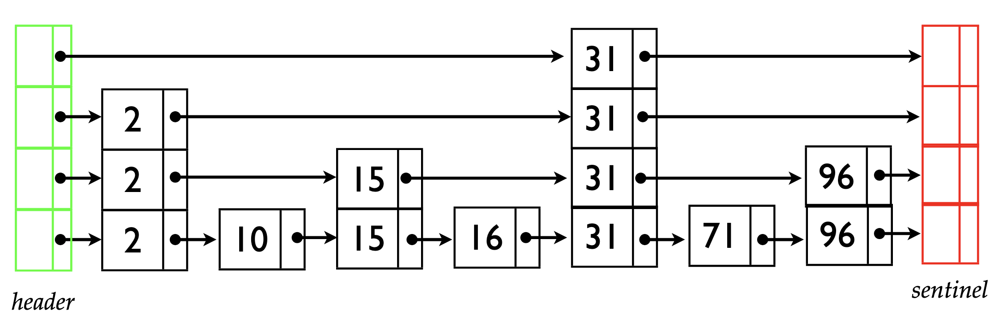

# Skip Lists

## Linked Lists Benefits & Drawbacks

**Benefits**

- Easy to insert & delete in O(1) time 
- Don’t need to estimate total memory needed
  
**Drawbacks**

- Hard to search in less than O(n) time (binary search doesn’t work, eg.)
- Hard to jump to the middle

## Skip Lists
Skip List fixes the drawbacks of _Linked List_ and it's also a good data structure for a dictionary ADT

### Perfect Skip Lists

* Keys in sorted order. 
* O(log n) levels
* Each higher level contains 1/2 the elements of the level below it.
* Header & sentinel nodes are in every level
* Nodes are of variable size: - contain between 1 and O(log n) pointers
* Pointers point to the start of each node(picture draws pointers horizontally for visual clarity)
* Called skip lists because higher level lists let you skip over many items

### Insert & Delete

* Insert & delete might need to rearrange the entire list
* Like Perfect Binary Search Trees, Perfect Skip Lists are _too_ structured to support efficient updates.
* Idea:
  - Relax the requirement that each level have exactly half the items of the previous level 
  - Instead: design structure so that we expect 1/2 the items to be carried up to the next level
  - Skip Lists are a randomized data structure: the same sequence of inserts / deletes may produce different structures depending on the outcome of random coin flips.
    
**Randomization**

* Idea: Each node is promoted to the next higher level with probability 1/2
  - Expect 1/2 the nodes at level 1
  - Expect 1/4 the nodes at level 2
  - ...
* Therefore, expect # of nodes at each level is the same as with perfect skip lists.

### Reference
https://www.cs.cmu.edu/~ckingsf/bioinfo-lectures/skiplists.pdf

http://ticki.github.io/blog/skip-lists-done-right