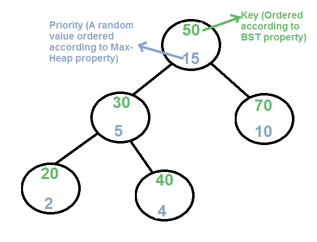
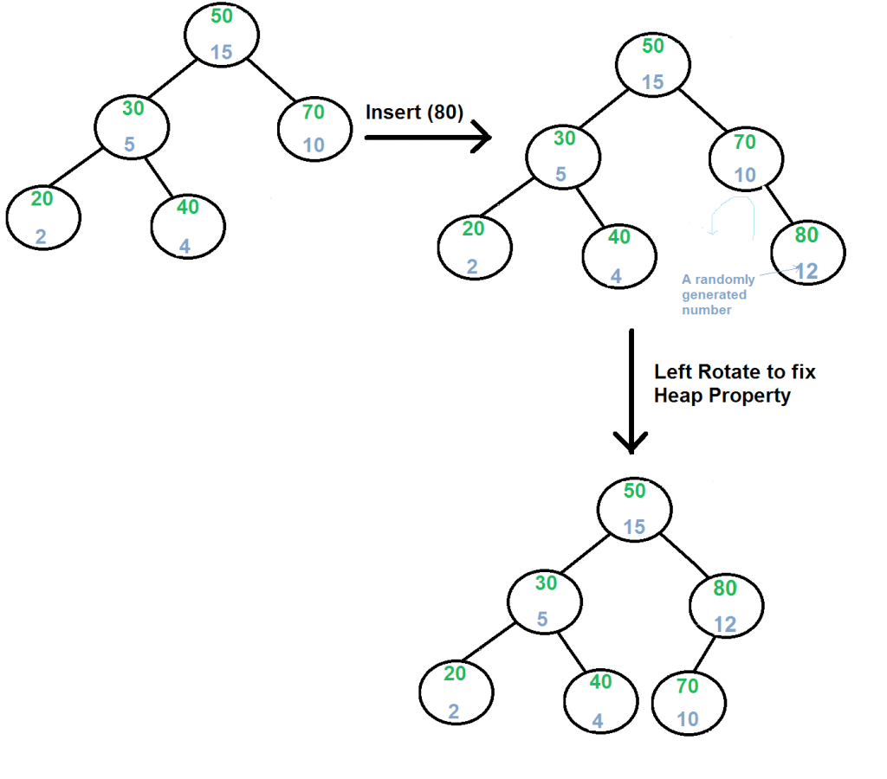
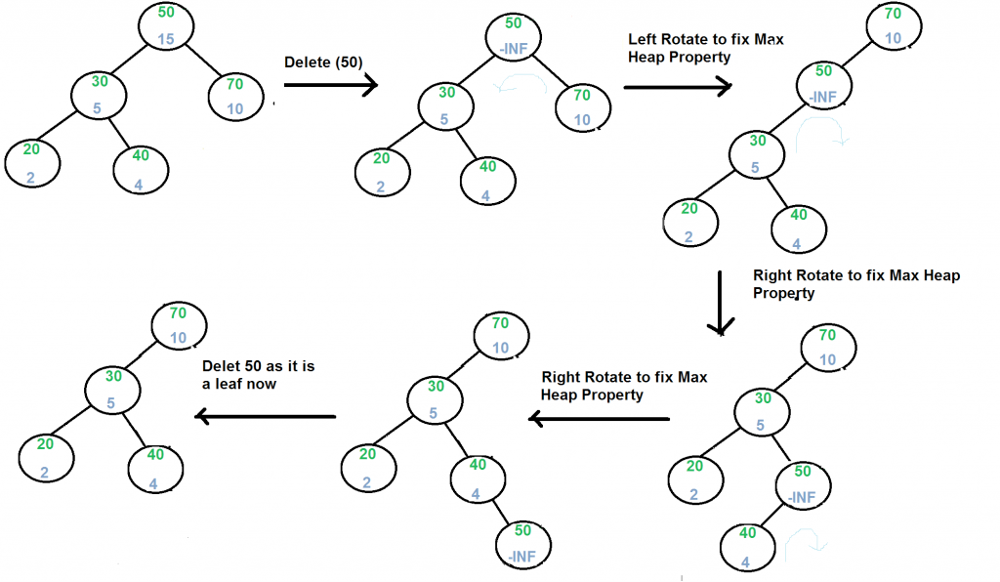

# Treap (A Randomized Binary Search Tree)

Like Red-Black and AVL Trees, Treap is a Balanced Binary Search Tree, but not guaranteed to have height as O(Log n). 
The idea is to use Randomization and Binary Heap property to maintain balance with high probability. 
The expected time complexity of search, insert and delete is O(Log n).



Every node of Treap maintains two values.
1) **Key** Follows standard BST ordering (left is smaller and right is greater)
2) **Priority** Randomly assigned value that follows Max-Heap property.

## Basic Operation on Treap:
Like other self-balancing Binary Search Trees, Treap uses rotations to maintain Max-Heap property during insertion and deletion.

```
T1, T2 and T3 are subtrees of the tree rooted with y (on left side) 
or x (on right side)           
                y                               x
               / \     Right Rotation          /  \
              x   T3   – – – – – – – >        T1   y 
             / \       < - - - - - - -            / \
            T1  T2     Left Rotation            T2  T3
Keys in both of the above trees follow the following order 
      keys(T1) < key(x) < keys(T2) < key(y) < keys(T3)
So BST property is not violated anywhere. 
```

### search(x)

Perform standard BST Search to find x.

### Insert(x)

1) Create new node with key equals to x and value equals to a random value.
2) Perform standard BST insert.
3) Use rotations to make sure that inserted node's priority follows max heap property.



### Delete(x)

1) If node to be deleted is a leaf, delete it.
2) Else replace node's priority with minus infinite ( -INF ), and do appropriate rotations to bring the node down to a leaf.



